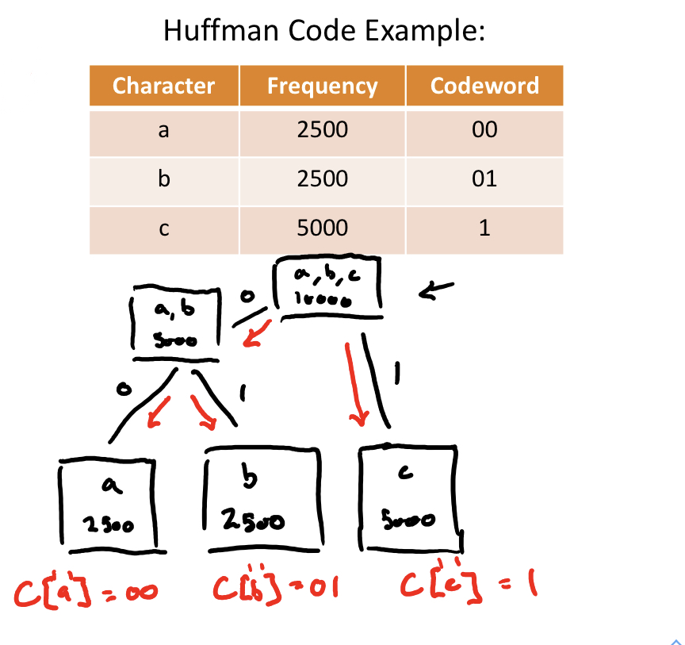

# BFS & DFS && shorest path via BFS
- input: a graph G represented in adjacency list form.
```
BFS(G):                                     DFS(G):                                     SP-BFS(G):
Queue q                                     Stack s                                     Queue q
# Add staring vertex to q
G[0].discovered = true                      G[0].discovered = true                      G[0].discovered = true
q.enqueue(G[0])                             s.push(G[0])                                q.enqueue(G[0])
                                                                                        G[0].dist = 0
while not q.is_empty():                     while not s.is_empty():                     while not q.is_empty:
    Vertex v = q.dequeue()                      Vertex v = s.pop()                          Vertex v = q.dequeue()
    for u in v.neighbors:                       for u in v.neighbors:                       for u in v.neighbors:
        if not u.discovered:                        if not u.discovered:                        if not u.discovered
            u.discovered = true                         u.discovered = true                         u.discovered = true
            q.enqueue(u)                                   s.push(u)                                q.enqueue(u)
                                                                                                    u.dist = v.dist + 1
```
# Divide-and-Conquer Template
1. Divide - Split the original problem into several smaller subproblems
2. Conquer - Solve each subproblem recursively
3. Combine - Aggregate the solutions

# Max-sub-array O(n)
```
    //CPP format
    int max_current;
    int max_global;
    max_current = max_global = array[0];
    for (int i = 1; i < array.size(); i++)
    {
        if (array[i] > array[i] + max_current)
            max_current = array[i];
        else
            max_current = max_current + array[i];
        max_global = max(max_current, max_global);
    }
    return max_global;
```

# Karatsuba Algorithm
Time complexity: T(n) = 4T(n/2) + O(n) = O(n^2) => T(n) = 3T(n/2) + O(n) = O(n^log2(3)) = O(n^1.58)
```
    a   b                                         c   d
X: 146 123 => X = a * 10^(n/1) + b            Y: 123 456 => Y = c * 10^(n/1) + d
X * Y = (ac)*10^n + (ad + bc)*10^(n/2) + bd
optimal:            (ad + bc)*10^(n/2) = (a+b)(c+d)-ac-bd
```

# Closest Pair

```
ClosestPair(s):
    left = ClosestPair(P-Left)
    right = ClosestPair(P-right)
    P-Strip = Strip of width is min(left, right)
    strip = ∞
    for p in P-Strip:
        for q in P-Strip with p.y - min(left, right) ≤ q.y ≤ p.y:
            if(p.x-q.x)^2 + (p.y-q.y)^2 < strip
                strip = (p.x-q.x)^2 + (p.y-q.y)^2
    return min(left, right, strip)
```

# Greedy algorithms
## Huffman codes

- inout: a table F with frequencies of n ≥ 2 characters
- output a tree T and a table C corresponding to the optimal binary prefix code for F
```
#Pseudocode
HuffmanCode(F):
    initialize n nodes with vi.char = ci, vi.freq=F[ci]
    insert v1, v2, .., vn into min-priority queue Q
    while |Q|>1:
        allocate new node u
        u.left_child = Q.exrtact_min()
        u.right_child = Q.exrtact_min()
        u.freq = u.left_child.freq + u.right_child.freq
        Q.insert(u)
    T = Q.extract_min()
    Construct C by running BFS/DFS on T
    return T, C
```
## MST - Kruskal algorithm
- MST: sum to minimum weight over all spaning trees
- Kruskal algorithm: start with the empty graph. Greedily add the lighest edge in E that does not introduce a cycle. 
- Repeat until no edges are left/ |E| = |V| - 1
1. Initalize a new graph T with the vertices of G but with no edges
2. Sort the edges of G by weight
3. For each edge(u,c) ∈ E (lightest to heaviest):
    if u,v are in different connected components of T:
        add(u,v) to the edges of T


# Sorting Algorithm

## Bubble Sort

## Merge Sort

## Binary Search
