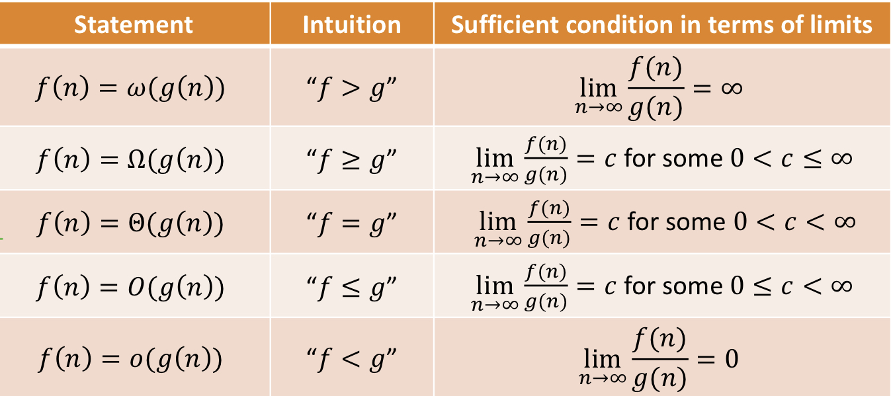

# Asymptotic notation
## Big-O
- upper bounds the growth rate of a function up to a constant
- If f(n)/g(n) = c for 0 ≤ c < ∞ then f(n) = O(g(n))
## Big-Ω
- lower bounds
- f(n) = Ω(g(n)) iif g(n) = O(f(n))
## Small-o
- f(n) = o(g(n)) if and only if f(n)/g(n) = 0
- e.g: 100n and e^n (derivative both)
## Small-w
- f(n) = w(g(n)) iif g(n) = o(f(n))

# Graph
## Simple graph
- Undirected and unweighted
- No self loop
- No parallel edges
## induced subgraph
- a subset of the vertices in the original graph together with all of the edges running between them.
## cyclicity
-acyclic if it does not contain a cycle as a subgraph

# Recurrences
- T(n) = aT(n/2) + O(n)
- a is # of subproblems; n/2 is size of subproblems; O(n) is the amount of work done in the 'combine phase'

