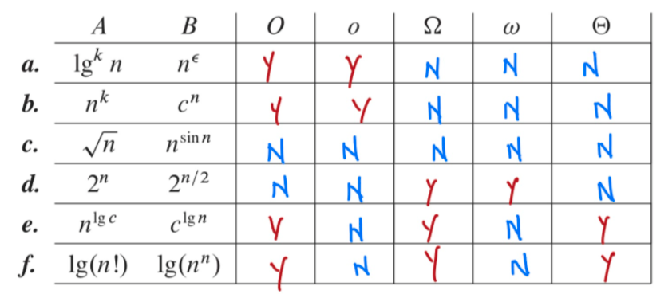
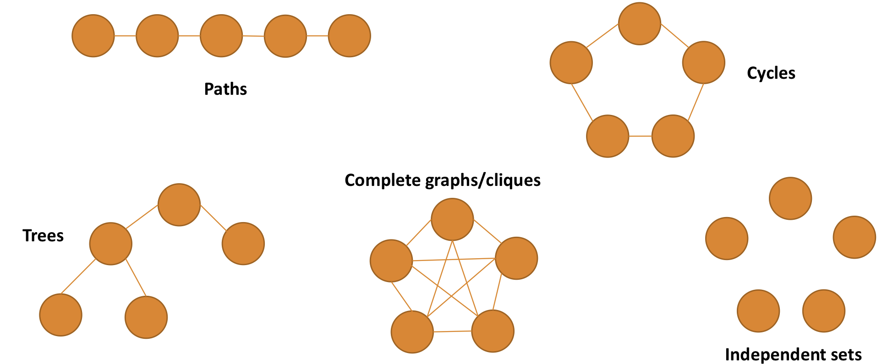
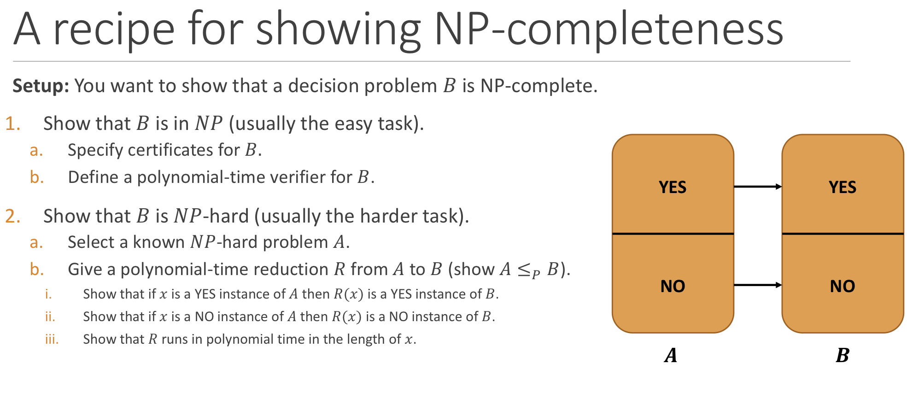
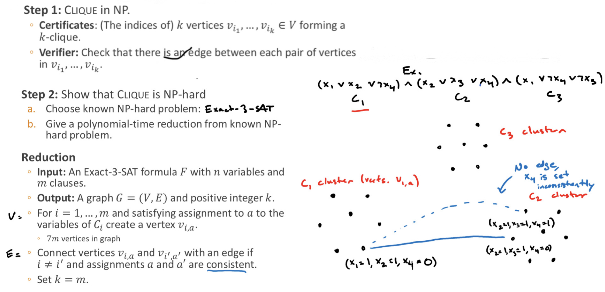

# Asymptotic notation
## Basic growth rate ordering rules
1. Logarithms vs. polynomials: for all a,b>0, (logn)^a = o(n^b)
2. Different polynomials: for all b > a > 0,  n^a = o(n^b)
3. Polynomials vs. exponentials: for all a>0, b>1 n^a = o(b^n)
- 
## Big-O
- upper bounds the growth rate of a function up to a constant
- If f(n)/g(n) = c for 0 ≤ c < ∞ then f(n) = O(g(n))
## Big-Ω
- lower bounds
- f(n) = Ω(g(n)) iif g(n) = O(f(n))
## Small-o
- f(n) = o(g(n)) if and only if f(n)/g(n) = 0
- e.g: 100n and e^n (derivative both)
## Small-w
- f(n) = w(g(n)) iif g(n) = o(f(n))

# Graph
- 
## Simple graph
- Undirected and unweighted
- No self loop
- No parallel edges
## induced subgraph
- a subset of the vertices in the original graph together with all of the edges running between them.
## cyclicity
-acyclic if it does not contain a cycle as a subgraph

# Recurrences T(n) = aT(n/b) + f(n)
- a is # of subproblems; 
- n/b is upper bound size of each subproblem; 
- f(n) work done to aggregate the subproblems
## Solving recurrences using Recursion Tree 
- height of tree: logb(n)

## Solving recurrences using Master Theorem

# Spanning Tree
- Possibility of ST: n^(n-2)

# Dynaic Programming
- Memoization
    1. "Top-down" dynamic programming
    2. Recursive. Stores solutions to subproblems for reuse
- Tabulation
    1. "Bottom-up" dynamic programming
    2. Iterative. Builds a table with solutions to subproblems

# P VS. NP
## P
- P stands for "polynomial"
- Set of efficiently solvable problems in polynomial time
- Problems in P: logn, n, nlogn, n^2
- Ex: addition, multiplication, closest pair of points, sorting, shortest paths, MST, ED...
## NP
- NP stands for "nondeterministic polynomial"
- Set of efficientlyverifiable problems in polynomial time
- Problems in NP: 2^n, n^n, n!
- Ex: Sudoku
## NP-comolete
- The hardest problems in NP
## Three versions of problems
- Decision problem
    1. A problem with a binary (YES or NO) answer
- Optimization problem
    1. What is the optimal value of the solutiom?
- Search problem
    1. What is the optimal solution itself?
## Verifiability
- 

# Reductions 
- A decision problem B is NP-hard if there is a polynomial-time reduction from **every** problem in NP to B.
    - B is at least as hard as the hardest problems in NP
- A decision problem B is NP-complete if it is in NP and is NP-hard.
    - B is one of the hardest problems in NP
- 

## SAT - The satisfiability problem
- A clause C is a disjunction (OR) of literals
    1. C = X1 v X2 v X3
- A CNF-Formula F is a conjunction (AND) of clauses
    1. CNF-SAT is the "first" NP-complete problem
    2. CNF stands for "conjunctive normal form," are a special type of circuit
    3. F = (X1 v X3 v X4) ^ (X2 v X5)
- 

## Clique
- NP-complete
- a k-clique in a graph is a set of k vertices **each pair** of which is connected by an edge
- 

## A search-to-decision reduction for IndependentSet
- search: fill in the YES instance
- decision: check if it is YES or NO instance
- [3-SAT reduce to IS](https://www.youtube.com/watch?v=lTqTk9AQR5s)
1. Binary search using D(black box algorithm) to find the size k
2. Make a copy of G1 of G
3. For each i = 1, ... , n:
    - ifD(G1-vi, k) = 1, delete vi and incident edges from G1
4. Output G1

## NP-Complete probems
- Logic: Circuit-SAT, CNF-SAT, 3-SAT
- Graph: Clique, IS, Graph coloring, hamiltonian path, travelling salesman problem
- Covering: Set cover, hitting set, streets and guards
- Optimization: integer programming, quadratic programming
- Games: Sudoku, minesweeper, optimally solving rubik's cubes
