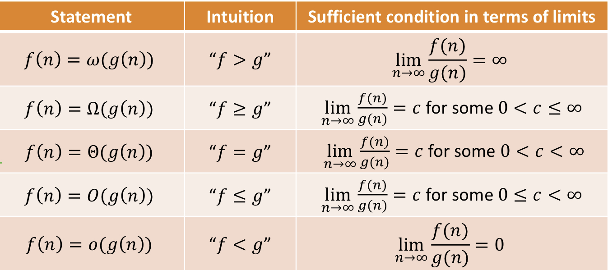

# Sorting Algorithm

## Bubble Sort

## Merge Sort

## Binary Search

# Asymptotic notation

## Big-O
- upper bounds the growth rate of a function up to a constant
- If f(n)/g(n) = c for 0 ≤ c < ∞ then f(n) = O(g(n))

## Big-Ω
- lower bounds
- f(n) = Ω(g(n)) iif g(n) = O(f(n))

## Small-o
- f(n) = o(g(n)) if and only if f(n)/g(n) = 0
- e.g: 100n and e^n (derivative both)

## small-w
- f(n) = w(g(n)) iif g(n) = o(f(n))

