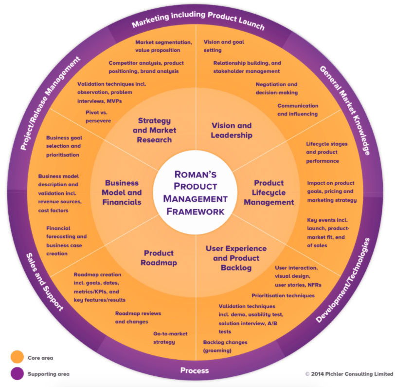
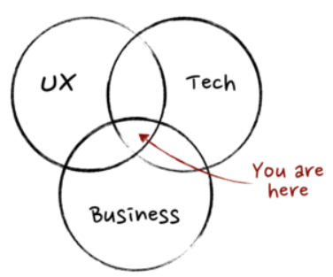

# [Product Vision](https://www.joelonsoftware.com/2002/05/09/product-vision/)

## The pattern to explain the project to someone within tow mins
- For (tarfet customer)
- Who (statement of the need or opportunity)
- The (product name) is a (product category)
- That (key benefit, compelling reason to buy)
- Unlike (primary competitive alternative)
- Our product (statement of primary differentiation)

example:
“For a mid-sized company’s marketing and sales departments who need basic CRM functionality, the CRM-Innovator is a Web-based service that provides sales tracking, lead generation, and sales representative support features that improve customer relationships at critical touch points. Unlike other services or package software products, our product provides very capable services at a moderate cost.”

## Benefits of vision statement
1. helps teams remain focused on the critical aspects of the product

"every project should be considered to produce a “product.” Whether the project results involve enhancements to an internal accounting system or a new e-commerce site, product-oriented thinking pays back benefits."

## Steps to get team to think about a product vision 
1. Design-the-Box exercise (developed originally by colleague Bill Shakelford)
2. In this exercise the entire team, including users, breaks up into groups of four to six (this works best with cross-functional participation).
3. The team makes the assumption that the product will be sold in a shrink-wrapped box, and their task is to design the product box front and back. (This involves coming up with a product name, a graphic, three to four key bullet points on the front to “sell” the product, a detailed feature description on the back, and operating requirements.)
4. Presentations by each of the groups are then followed by discussing how the multiple focal points can be reduced to a few that everyone agrees upon.
5. Once this exercise has been completed, the group can then work on constructing their own version of Moore’s product vision statement.
6. Finally, the group can construct a good outline for a complete one- to three-page product vision document that might include: 
    - the mission statement
    - a project profile overview (scope, schedule, cost, defects) with priorities
    - pictures of the “boxes” 
    - target customers and each of their needs
    - customer satisfaction measures
    - key technology and operational requirements
    - critical product constraints (performance, ease of use, volumes), and key financial indicators.

# [What is Product Management](https://www.romanpichler.com/blog/romans-product-management-framework/)

## Core Knowledge areas
1. Vision and Leadership
    - Establish a [shared vision](https://www.romanpichler.com/blog/tips-for-writing-compelling-product-vision/)
        1. Describe the Motivation behind the Product
        2. Look beyond the Product
        3. Distinguish between Vision and Product Strategy
        4. Employ a Shared Vision
        5. Choose an Inspiring Vision
        6. Think Big
        7. Keep your Vision Short and Sweet
        8. Use the Vision to Guide your Decisions
    - Set realistic goals
    - Describe the benefits the product should deliver
    - Be able to actively listen to others
    - Negotiate to reach agreement and get buy-in.
2. Product Life Cycle Management
    - Understand the product life cycle with its stages and the key events in the life of your product including launch, product-market fit, and end of sales.
    - Know how the lifecycle helps you maximise the benefits your product creates across its entire life
    - The options to revive growth as your product matures and growth starts to stagnate.
3. Product Strategy and Market Research
    - Be able to identify your target users and customers and segment the market
    - Be able to clearly state the value proposition of your product, why people would want to use and buy it and why your product does a great job at creating value for them
    - Be able to carry out a competitor analysis to understand their respective strengths and weaknesses
    - Be able to position your product, and determine the values the brand needs to communicate
    - Be able to perform the necessary market research work to test your ideas and assumptions about the market segment and the value proposition
    - Be able to leverage data to make the right decisions
4. Business Model and Financials
    - Be able to determine the value the product creates for your firm
    - Be able to formulate and prioritise business goals
    - Be able to describe how your product’s value proposition is monetised and capture how the business model works including the revenue sources and the main cost factors
    - Be able to create a financial forecast or business case that describes when a break-even is likely to occur and when your product may become profitable
5. Product Roadmap
    - Be able to create and use a product roadmap. This includes formulating realistic product goals (benefits), metrics and key performance indicators (KPIs), release dates or timeframes, and key features (deliverables or results)
    - Be clear on the relationship between the product strategy and the product roadmap
    - Be able to formulate a go-to-market strategy and capture it in your roadmap
    - Should understand when the roadmap should be reviewed and changed.
6. User Experience and Product Backlog
    - Be able to describe the desired user experience. This includes describing users and customer as personas, capturing the user interaction, the visual design, the functional and the non-functional aspects of your product together with the help of the cross-functional team (a UX/UI expert should be part of the team)
    - Be able to create [scenarios](https://www.romanpichler.com/blog/agile-scenarios-and-storyboards/), epics, [user stories](https://www.romanpichler.com/blog/epics-and-ready-stories/), storyboards, workflow diagrams and storymaps
    - Be able to work with [user interface sketches and mock-ups](https://www.romanpichler.com/blog/agile-user-interface-design/)
    - Be able to stock and manage the product backlog, prioritise it effectively, and select [sprint goals](https://www.romanpichler.com/blog/effective-sprint-goals/)
    - Know how to understand if you develop a product with the right features and the right UX, how to test the appropriate aspects of your product and how to collect the relevant feedback and data (include the ability to perform [product demos, solution interviews, usability tests, A/B tests, and direct observation](https://www.romanpichler.com/blog/beyond-product-demo-validation-techniques-in-scrum/))
    - Be able to use an analytics tool to retrieve the relevant data and be able to analyse it effectively
    - Be able to [change (or “groom”) the product backlog](https://www.romanpichler.com/blog/the-product-backlog-refinement-steps/) using the newly gained insights.

## The supporting knowledge areas
1. General Market Knowledge
    - Understand who your current customers and users are
    - what product you offer them today including their value proposition and business model
    - what competitors you have, how big your market share currently is, and which market segments you serve well.
2. Development/Technologies
    - Be a competent partner for development/IT/engineering
    - have an interest in software technologies
    - be comfortable collaborating with a cross-functional technical team.
3. Marketing
    - Be a respected partner for (product) marketing
    - be able to help select the right marketing channels and to determine the right marketing mix
    - help marketing with creating the marketing collateral.
4. Sales and Support
    - Be a respected partner for sales and support
    - be able to help choose the right sales channels and create the sales collateral and training.
5. Project/Release management
    - Be able to determine the primary success factor for a major release/product version and to steer the development project
    - be able to determine the project progress to forecast the progress(for instance, using a release burndown chart)
    - be able to work with the Definition of Done
    - be able to trade-off scope, time, and budget.
6. Process
    - Have a good understanding of ideation and innovation processes to generate and select ideas and to bring new products and new features to life. These should include Customer Development/Lean Startup, Business Model Generation, [Scrum](https://www.romanpichler.com/blog/the-scrum-cycle/), and Kanban.

# [What, exactly, is a product manager](https://www.mindtheproduct.com/what-exactly-is-a-product-manager/)

- product management as the intersection between business, technology, and user experience.

## Business
1. Product Managers should be obsessed with optimising a product to achieve the business goals while maximising return on investment

## Technology
1. understanding the technology stack and level of effort involved is crucial to making the right decisions

## UX
1. Product Manager is the voice of the user inside the business and must be passionate about the user experience